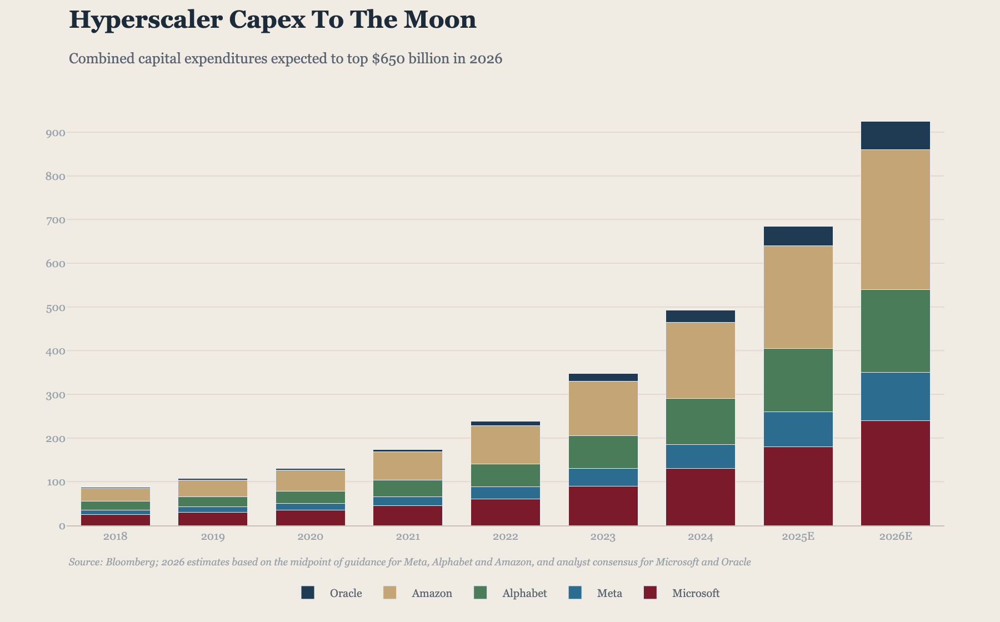
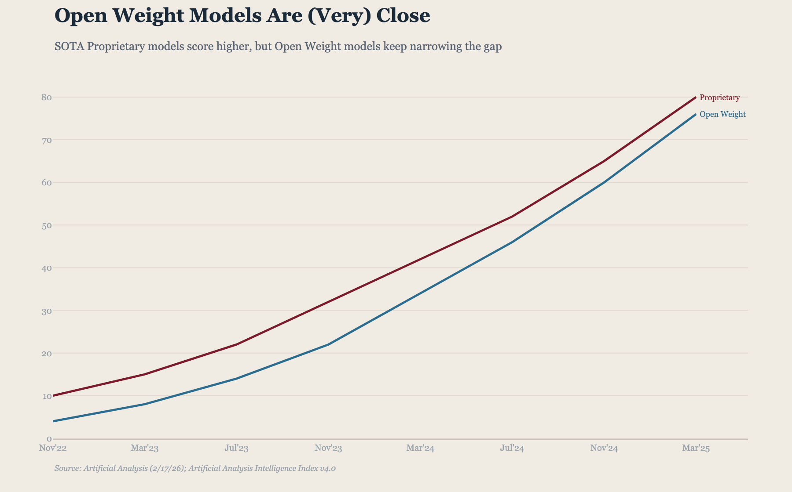
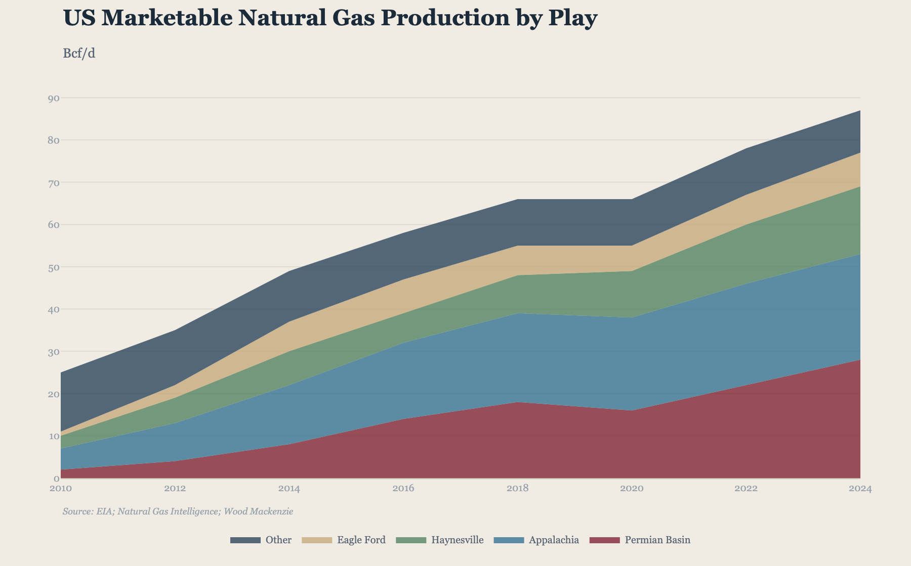
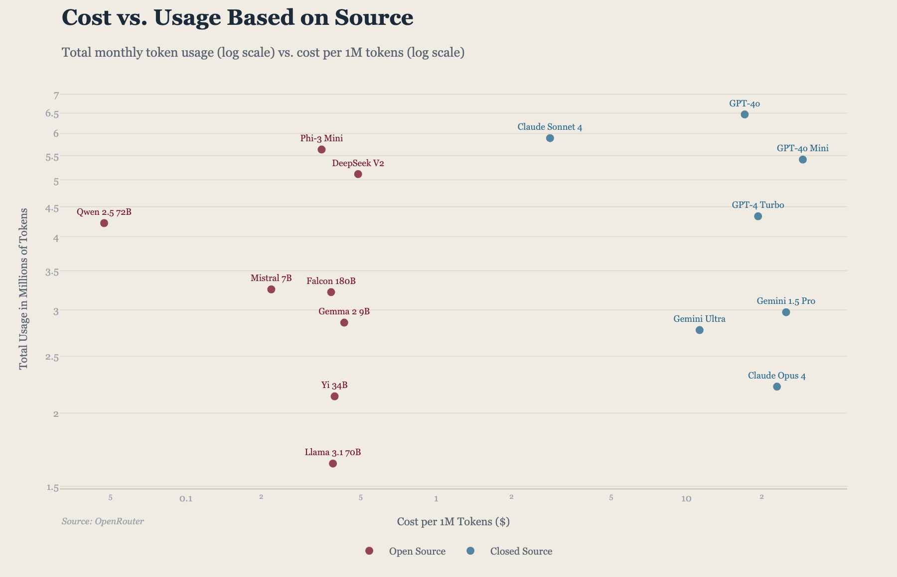
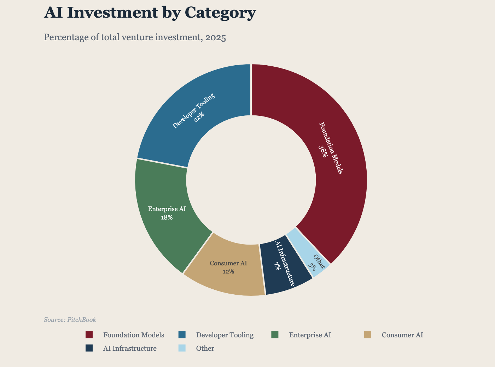
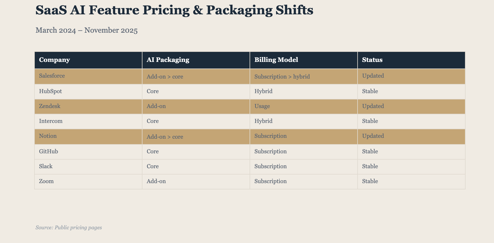
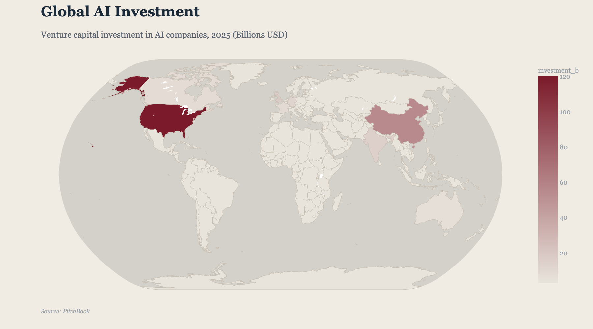
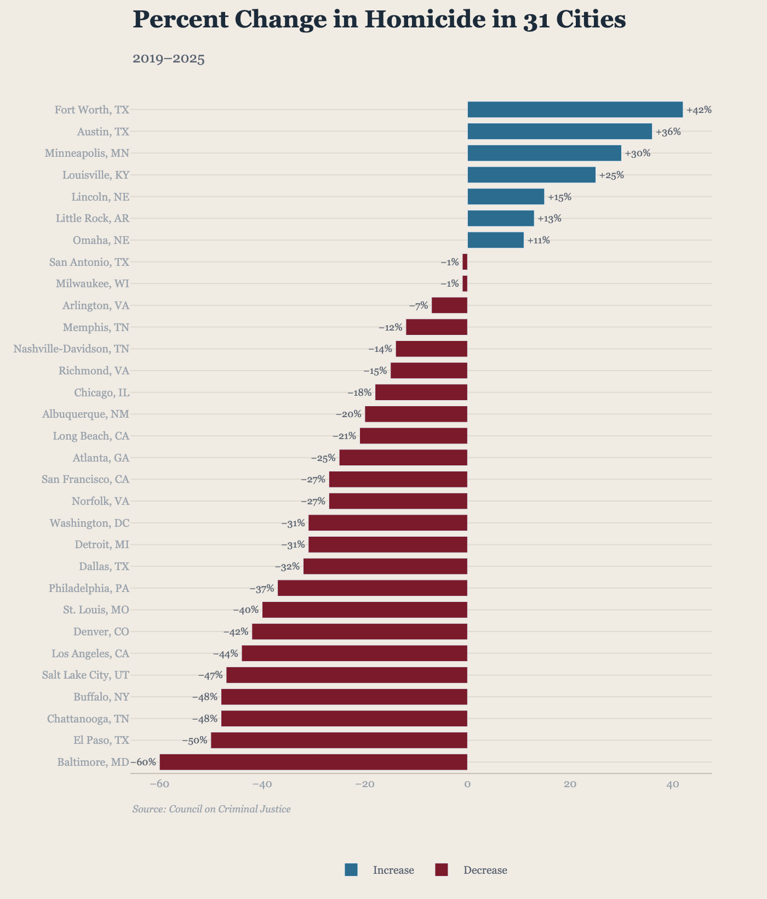
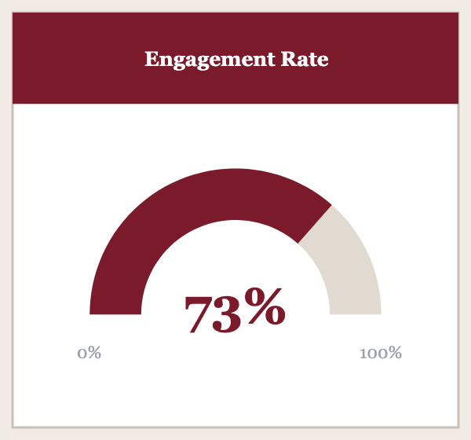

# chart-library

A themeable Plotly chart library. Every chart function returns a `plotly.graph_objects.Figure` — display it interactively in a notebook or browser, or export as a static PNG. The visual style is fully defined in a YAML theme file you can swap out or override at any level.

Comes bundled with the `a16z-news` theme. Pass `theme=None` to skip all styling and use Plotly's defaults.

---

## Install

```bash
pip install git+https://github.com/marksher/a16z-chart-library.git
```

For PNG export you also need kaleido:

```bash
pip install kaleido
```

**If you cloned the repo** and want to develop locally:

```bash
pip install -e .
```

---

## See it first

Open the gallery to see all chart types side by side — interactive Plotly on the left, PNG export on the right:

```bash
open examples/a16z-news/all.html
```

To regenerate all example outputs (PNGs + HTML files):

```bash
python examples/a16z-news/bar.py
python examples/a16z-news/line.py
# … or run them all:
for f in examples/a16z-news/*.py; do python "$f"; done

# Rebuild the all.html gallery:
python examples/generate_all.py
```

---

## Quick start

```python
import pandas as pd
from chart_library import bar, save_png

df = pd.DataFrame({
    "company": ["OpenAI", "Anthropic", "Google", "Meta"],
    "revenue":  [3.7,     0.8,         2.1,      1.4],
})

fig = bar(
    df,
    x="company",
    y="revenue",
    title="AI Revenue Estimates",
    subtitle="Billions USD, 2025",
    source="Company filings; analyst estimates",
)

fig.show()                    # opens an interactive chart in your browser (or renders inline in Jupyter)
save_png(fig, "revenue.png")  # exports a static PNG at 2× resolution
fig.write_html("revenue.html")  # exports a fully self-contained interactive HTML file
```

---

## Chart types

All chart functions share these common parameters:

| Parameter | Default | Description |
|-----------|---------|-------------|
| `title` | `""` | Bold headline |
| `subtitle` | `None` | Lighter supporting line |
| `source` | `None` | Source attribution (bottom-left) |
| `theme` | `"a16z-news"` | Theme name, file path, `Theme` object, or `None` for Plotly defaults |
| `width` | `900` | Figure width in pixels |
| `height` | `560` | Figure height in pixels |

---

### Bar chart

```python
from chart_library import bar

# Single-series horizontal bar
fig = bar(
    df,
    x="category",
    y="value",
    orientation="h",       # "v" (default) or "h"
    show_values=True,      # annotate each bar with its value
    title="My Chart",
)

# Multi-series stacked vertical bar
fig = bar(
    df,
    x="year",
    y=["Series A", "Series B", "Series C"],
    stacked=True,
    show_values=False,
    title="Stacked Example",
)
```



---

### Line chart

```python
from chart_library import line

fig = line(
    df,
    x="date",
    y=["Proprietary", "Open Weight"],  # one or more series
    end_labels=True,                   # inline labels at line ends instead of legend
    dashed=["Open Weight"],            # render specific series as dashed
    title="Open Weight Models Are (Very) Close",
    subtitle="SOTA Proprietary models score higher, but Open Weight models keep narrowing the gap",
    source="Artificial Analysis",
)
```



---

### Area chart

```python
from chart_library import area

fig = area(
    df,
    x="year",
    y=["Permian Basin", "Appalachia", "Haynesville", "Eagle Ford", "Other"],
    stacked=True,   # True = stacked fills, False = overlapping
    title="US Natural Gas Production by Play",
    subtitle="Bcf/d",
    source="EIA; Wood Mackenzie",
)
```



---

### Scatter / bubble chart

```python
from chart_library import scatter

# Categorical coloring — one color per category
fig = scatter(
    df,
    x="cost",
    y="usage",
    color_col="type",       # color points by a categorical column
    label_col="model",      # annotate each point with text
    title="Cost vs. Usage Based on Source",
    source="OpenRouter",
)

# Bubble chart — size encodes a third variable
fig = scatter(
    df,
    x="cost",
    y="performance",
    size_col="market_share",
    title="Market Landscape",
)
```



---

### Pie / donut chart

```python
from chart_library import pie

fig = pie(
    df,
    labels="category",
    values="share",
    hole=0.55,    # 0 = full pie, >0 = donut; defaults to theme value
    title="AI Investment by Category",
    subtitle="Percentage of total venture investment, 2025",
    source="PitchBook",
)
```



---

### Table

```python
from chart_library import table

fig = table(
    df,
    title="SaaS AI Pricing & Packaging Shifts",
    subtitle="March 2024 – November 2025",
    source="Public pricing pages",
    highlight_rows=[0, 2, 4],   # row indices to highlight
)
```



---

### Map (choropleth)

```python
from chart_library import map_chart

# World map using ISO-3 country codes
df = pd.DataFrame({
    "country":      ["USA", "CHN", "GBR", "IND", "DEU"],
    "investment_b": [120,   55,    18,    15,    12],
})

fig = map_chart(
    df,
    locations="country",
    values="investment_b",
    location_mode="ISO-3",   # "ISO-3" (world) or "USA-states"
    title="Global AI Investment",
    subtitle="Billions USD, 2025",
    source="PitchBook",
)

# US state map using 2-letter state codes
fig = map_chart(
    df,
    locations="state",
    values="value",
    location_mode="USA-states",
    title="Investment by State",
)
```



---

### Diverging bar chart

```python
from chart_library import diverging_bar

fig = diverging_bar(
    df,
    x="category",
    y="change",
    title="Net Sentiment by Topic",
    subtitle="Positive values = favorable, negative = unfavorable",
    source="Survey data",
)
```



---

### Sparklines

Minimal inline charts with no axes, titles, or legends — designed for tables, dashboards, or tight spaces.

```python
from chart_library import sparkline_line, sparkline_area, sparkline_bar

# Line sparkline with end dot
fig = sparkline_line(df, x="date", y="value", end_dot=True, width=200, height=60)

# Filled area sparkline
fig = sparkline_area(df, x="date", y="value", opacity=0.6, width=200, height=60)

# Bar sparkline
fig = sparkline_bar(df, x="date", y="value", width=200, height=60)
```

---

### Stat card

KPI card with a colored header banner and a large number.

```python
from chart_library import stat_card

fig = stat_card(
    value="12,847",
    label="Active Users",
    width=300,
    height=200,
)
```


---

### Big number

Prominent single-metric display with an optional label.

```python
from chart_library import big_number

fig = big_number(
    value="$3.7B",
    label="Total AI Investment",
    width=250,
    height=150,
)
```


---

### Gauge

Semicircular dial chart with a colored header banner, arc fill, and min/max labels.

```python
from chart_library import gauge

fig = gauge(
    value=73,
    label="Engagement Rate",
    min_val=0,
    max_val=100,
    width=300,
    height=280,
)
```



---

## Themes

The visual style — fonts, colors, grid, margins, branding, legend — is fully defined in a YAML file. Swap it out entirely, point to a custom file, or pass `None` to use plain Plotly defaults (no custom fonts, colors, or branding).

```python
# 1. Built-in theme by name (default)
fig = bar(df, x="x", y="y", theme="a16z-news")

# 2. Path to a custom YAML file
fig = bar(df, x="x", y="y", theme="path/to/my-theme.yaml")

# 3. Pre-loaded Theme object
from chart_library import load_theme
t = load_theme("path/to/my-theme.yaml")
fig = bar(df, x="x", y="y", theme=t)

# 4. No theme — plain Plotly defaults
fig = bar(df, x="x", y="y", theme=None)
```

### Building a custom theme

Copy `themes/a16z-news/theme.yaml` as a starting point. All keys are optional — omitted keys fall back to Plotly defaults.

```yaml
name: my-brand
version: "1.0"

background: "#FFFFFF"
plot_background: "#FFFFFF"

text:
  title: "#000000"
  subtitle: "#666666"
  axis: "#999999"
  source: "#999999"
  label: "#444444"

palette:
  - "#0057B7"   # primary
  - "#FF8C00"   # secondary
  - "#228B22"   # tertiary

fonts:
  family: "Inter, Arial, sans-serif"

font_sizes:
  title: 22
  subtitle: 13
  axis_tick: 10
  axis_label: 11
  source: 9
  data_label: 9

margins:
  top: 90
  bottom: 60
  left: 60
  right: 50

grid:
  color: "#EEEEEE"
  width: 1
  horizontal: true
  vertical: false

spines:
  top: false
  right: false
  color: "#CCCCCC"
  width: 1

legend:
  position: "bottom"
  orientation: "h"
  border: false

branding:
  show: true
  text: "MY BRAND"         # shown when no image is set
  # image: "logo.svg"      # SVG, PNG, or JPG — local path or URL; takes priority over text
  # image_width: 60        # pixels (default 60)
  # image_height: 20       # pixels (default 20)
  # opacity: 1.0
  position: "bottom_right"
  color: "#000000"
  font_size: 10
  font_weight: "bold"

source:
  prefix: "Source: "
  italic: true

# Per-chart-type overrides
bar:
  gap: 0.25
  group_gap: 0.05

line:
  width: 2.5
  end_labels: true
  markers: false

area:
  opacity: 0.75
  line_width: 0

scatter:
  marker_size: 8
  opacity: 0.8

pie:
  hole: 0.55

table:
  header_background: "#000000"
  header_text: "#FFFFFF"
  highlight_color: "#FFD700"
  border_color: "#EEEEEE"

map:
  land_color: "#E8E8E8"
  ocean_color: "#D4D4D4"
  border_color: "#CCCCCC"
```

### Inspecting a theme

```python
from chart_library import load_theme

t = load_theme("a16z-news")
print(t.palette)             # ['#7B1A2A', '#2B6C8F', ...]
print(t.fonts["family"])     # "Georgia, 'Times New Roman', serif"
```

---

## Export

```python
from chart_library import save_png

# Static PNG at 2× resolution (recommended for presentations and reports)
save_png(fig, "chart.png", scale=2)

# Standard resolution
save_png(fig, "chart.png", scale=1)

# Self-contained interactive HTML — no server needed, works offline
fig.write_html("chart.html")

# Interactive in Jupyter — renders inline in the notebook
fig.show()
```

`save_png` requires kaleido:

```bash
pip install kaleido
```

SVG export is also available:

```python
from chart_library import save_svg

save_svg(fig, "chart.svg")  # vector SVG — requires kaleido
```

PDF export is not currently supported — use SVG for vector output or HTML for interactive output.

---

## Repository layout

```
examples/
  a16z-news/         ← Example scripts + output PNGs + all.html gallery (open this first)
  default/           ← Same examples rendered with theme=None (plain Plotly)
  generate_all.py    ← Rebuilds examples/a16z-news/all.html

graphs/              ← Scraped chart images organized by type (bar/, line/, area/, etc.)
                       Open graphs/browse.html to browse visually

progress/            ← Scraper state: completed_articles.txt + in_progress/ markers

scripts/
  chart_library/     ← The pip-installable Python package (charts/, themes/, utils/)
  scrape.py          ← Web scraper that populates source/ and graphs/
  build_browse_html.py ← Regenerates graphs/browse.html
  reclassify.py      ← Reclassifies images in graphs/other/

source/              ← Raw HTML cache of scraped articles (YYYY-MM/slug/)

themes/
  a16z-news/
    theme.yaml       ← Editable copy of the bundled theme — start here to make your own
```

---

## Design system — a16z-news theme

| Element | Value |
|---------|-------|
| Background | `#F0EBE3` warm parchment |
| Title | Georgia, bold, 22px, `#1C2B3A` |
| Subtitle | Georgia, 13px, `#5A6472` |
| Axis text | Georgia, 10px, `#9AA3AC` |
| Primary color | `#7B1A2A` maroon/burgundy |
| Full palette | maroon → teal → sage → gold → navy → light blue → salmon |
| Grid | Horizontal only, `#E0DAD0`, 1px |
| Legend | Below chart, horizontal, no border |
| Branding | Bold, bottom-right, `#1C2B3A` |
| Source | Italic, bottom-left, `#9AA3AC`, 9px |

All chart types enforce the same set of attributes — title treatment, background, fonts, source attribution, and branding are consistent across bar, line, pie, table, and map.
